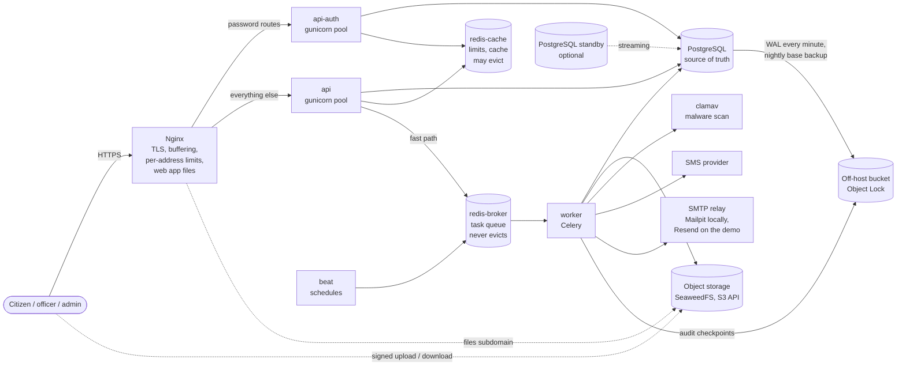

# Architecture

One Django codebase, run as several processes with different jobs, around one PostgreSQL database. Everything runs from one Compose file on one server; each piece can move to its own host later without code changes. The reasons behind each shape are in the [decision records](decisions/); the problem they answer is in [problem.md](problem.md).

The off-host bucket is any S3 store with Object Lock on another system, reached through the server's instance role. On the public demo it is an S3 bucket in ap-south-1. Local runs use a bucket on the SeaweedFS container, which supports the same locks.

## Processes

| Process | Job | If it stops |
|---|---|---|
| `nginx` | TLS, buffers slow clients, per-address rate limits, routes password hashing to `api-auth`, serves the web app (static files built from `web/`) | Site down |
| `api` | Every endpoint except password hashing | Site down (Nginx answers 502) |
| `api-auth` | Login, register, password set/reset, two-step verify | Logins fail; logged-in users unaffected |
| `worker` | Sends notifications, verifies uploads, recomputes deadlines | Work waits in PostgreSQL; nothing is lost |
| `beat` | Triggers the sweepers, sealer, overdue check, cleanup | Same as above |
| `postgres` | All data and every rule that can be a constraint | Site down |
| `redis-broker` | Task queue | Web requests continue; sweepers deliver after restart |
| `redis-cache` | Rate-limit counters, cache | Limits fail open; everything else continues |
| `storage` | Citizens' files | Uploads and downloads fail; links can still be signed |
| `clamav` | Scans every uploaded file (production; local runs use an EICAR stand-in) | New files wait unverified and are retried; none is approved unscanned |
| `monitor` | Service levels from Nginx's log, dependency checks, alerts to a phone | No alerts; nothing else changes |

## How a submission flows

1. The citizen's app sends `POST /requests/{id}/actions/submit` with an `Idempotency-Key`. A retry with the same key returns the stored answer instead of a second request.
2. In **one transaction**: lock the request row, check the transition is allowed for this user and state, give it a tracking number from the year's sequence (with a check digit), compute its deadline in working days, write a timeline event, write an audit row, and write a notification row.
3. After commit, the notification is handed to the broker. If the broker is down, the row simply waits: the **sweeper** finds it within 30 seconds of the broker coming back. A circuit breaker stops each web process from trying the dead broker again for 30 seconds, so requests stay fast during an outage.
4. A worker **leases** the notification row, sends the SMS or email outside any transaction, and records the result. Only the lease holder can complete it; a crashed worker's lease expires and the row is retried, with a cap on attempts.

## The rules live in the database

The application checks everything first, but PostgreSQL is the last line ([decision 1](decisions/0001-postgresql-enforces-the-rules.md)):

- Status and the columns each status requires (a resolved request has a resolution note, an assigned one has an officer).
- One open SLA pause per request; valid deadlines; a reviewer is never the person being reviewed.
- Audit, timeline and access-log tables accept inserts only (a trigger plus grants). The one allowed update to an audit row is sealing it, once.
- The API connects as a role that cannot change the schema; migrations run as another; the worker has a third role with only what it needs. Each role has its own statement timeout.

Tests insert illegal rows directly and assert that PostgreSQL rejects them (`tests/integration/db/`).

## Deadlines

A category has a target in working days. Deadlines count Sunday to Thursday in Dhaka time, skip holidays and suspension periods, and stop while the office waits on the citizen. Changing a holiday recomputes the open requests it affects, in batches that lock the same rows a transition would. Every five minutes, requests past their deadline are flagged once per cycle and the officer and department admins are told. An officer can pause the clock by asking the citizen for information twice per cycle; a third time needs an administrator.

## Accountability

- **Audit log**: every state change and admin action, append-only. Every minute a sealer chains new rows with SHA-256 and copies a checkpoint, locked, to a write-once bucket on another system. `manage.py verify_audit` checks the chain against those copies, which root on this server cannot change; the nightly restore checks run it on the restored copies ([decision 6](decisions/0006-hash-chained-audit-log.md)).
- **Access log**: every time staff open, change or download a request, and every list page they see. Citizens see which office and role looked (not names); admins see who ([decision 17](decisions/0017-staff-access-is-visible.md)).
- **Break-glass**: opening a request outside one's department needs a reason code, and appears in a report.
- **Review queue**: rejections in the last fifth of the deadline, and 5% of resolutions, go to an administrator who can uphold or overturn them. Nobody reviews their own decision.
- **Statistics**: each headline number comes with the numbers that would expose it being gamed ([decision 16](decisions/0016-every-statistic-has-a-counterweight.md)).

## Watching it

Nginx writes every request as a JSON line; the `monitor` process reads them each minute and keeps per-minute counts for six hours. It alerts, through a private ntfy topic on a phone, when:

| Alert | When |
|---|---|
| `availability_fast_burn` | Over 7.2% of API requests failed in the last hour and the last 5 minutes (the month's 0.5% error budget would be gone in about 2 days) |
| `availability_slow_burn` | Over 3% failed in the last 6 hours and the last 30 minutes (gone in about 5 days) |
| `latency` | p95 above 1 second over 15 minutes |
| `site_down` | `/health/ready` fails through the public address and TLS |
| `database_down` | The database does not answer |
| `notifications_late` | A status or action message has waited over 15 minutes |
| `attachments_stuck` | An upload has waited over 30 minutes for its scan |
| `audit_anchors_pending` | An audit checkpoint has not been copied off the host for 10 minutes |
| `wal_archiving` | PostgreSQL cannot ship WAL to the off-host bucket (the minute-level recovery point is at risk and WAL piles up on disk) |
| `disk_full`, `certificate_expiring` | Disk over 85%; certificate under 14 days from expiry |

An alert is sent when it starts, every 2 hours while it lasts, and when it clears. A GitHub Actions job checks the public address from outside every 10 minutes, for when the whole server is down. Why this and not a metrics stack: [decision 10](decisions/0010-alerts-from-the-edge-log.md).

## Scaling path

Measured ceiling on 2 vCPUs: about 80 requests a second with no errors. The next steps, in order:

1. More `api` replicas behind the same Nginx (stateless; sessions are tokens).
2. PostgreSQL on its own host, with the standby as a read replica for statistics.
3. Broker and cache on their own hosts.
4. Object storage replicated across two hosts.

Nothing in the code assumes a single host.
