# Diagrams

The system in pictures, from the widest view down to single flows. Each diagram is drawn from the code and names the file it comes from, so it can be checked. GitHub draws them from the Mermaid text below; the text is also the source, so a change to the system is a change to this file.

| # | Diagram | Answers |
|---|---|---|
| 1 | [Context](#1-context) | Who uses it, and what outside services it talks to |
| 2 | [Containers on the server](#2-containers-on-the-server) | What runs where, and who talks to whom |
| 3 | [The edge: how Nginx routes a request](#3-the-edge-how-nginx-routes-a-request) | Which pool serves which path, under which limit |
| 4 | [The timeout ladder](#4-the-timeout-ladder) | Why a slow query cannot hang a worker |
| 5 | [Layers of rate limiting](#5-layers-of-rate-limiting) | What stops floods, at which layer, keyed on what |
| 6 | [A request's life](#6-a-requests-life) | The 8 states and who may move a request between them |
| 7 | [Signing up as a citizen](#7-signing-up-as-a-citizen) | Register, confirm by SMS, logged in |
| 8 | [An officer's first login](#8-an-officers-first-login) | From "added by an administrator" to working |
| 9 | [An administrator's two-step login](#9-an-administrators-two-step-login) | Password, then a TOTP code |
| 10 | [Staying logged in](#10-staying-logged-in) | Refresh rotation, the grace window, stolen-token detection |
| 11 | [Submitting a request](#11-submitting-a-request) | Idempotency, one transaction, the outbox |
| 12 | [Delivering a message](#12-delivering-a-message) | Broker, leases, the sweeper, the circuit breaker |
| 13 | [Attaching a file](#13-attaching-a-file) | Straight to storage, then scanned |
| 14 | [The audit chain](#14-the-audit-chain) | Why history cannot be rewritten quietly |
| 15 | [Backups and recovery](#15-backups-and-recovery) | What leaves the server, when, and how it is proven |
| 16 | [The night on the server](#16-the-night-on-the-server) | Scheduled jobs, in order |
| 17 | [Database roles](#17-database-roles) | Who may do what inside PostgreSQL |
| 18 | [Data model](#18-data-model) | The main tables and how they relate |
| 19 | [How a deadline is set](#19-how-a-deadline-is-set) | Working days, holidays, pauses |
| 20 | [Watching it](#20-watching-it) | From an Nginx log line to an alert on a phone |
| 21 | [From a commit to the live site](#21-from-a-commit-to-the-live-site) | CI, review, deploy, rollback |

---

## 1. Context

Everything outside the dashed box is someone else's. Only Nginx faces the internet.

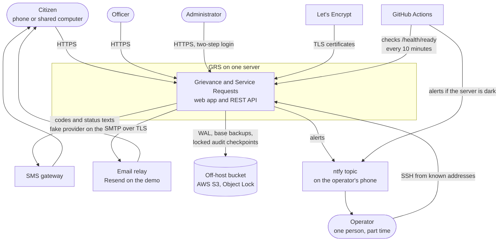
```mermaid
flowchart TB
  citizen([Citizen<br/>phone or shared computer])
  officer([Officer])
  admin([Administrator])
  operator([Operator<br/>one person, part time])

  subgraph grs [GRS on one server]
    system[Grievance and Service Requests<br/>web app and REST API]
  end

  citizen -->|HTTPS| system
  officer -->|HTTPS| system
  admin -->|HTTPS, two-step login| system
  operator -->|SSH from known addresses| system

  system -->|codes and status texts<br/>fake provider on the demo| sms[SMS gateway]
  system -->|SMTP over TLS| mail[Email relay<br/>Resend on the demo]
  system -->|WAL, base backups,<br/>locked audit checkpoints| s3[(Off-host bucket<br/>AWS S3, Object Lock)]
  system -->|alerts| ntfy[ntfy topic<br/>on the operator's phone]
  le[Let's Encrypt] -->|TLS certificates| system
  gha[GitHub Actions] -->|checks /health/ready<br/>every 10 minutes| system
  gha -->|alerts if the server is dark| ntfy
  sms --> citizen
  mail --> citizen
  ntfy --> operator
```

---

## 2. Containers on the server

One Compose project on one EC2 instance (`docker-compose.yml` with `docker-compose.prod.yml`). Only Nginx publishes ports. Solid arrows are requests; dotted arrows are background work.

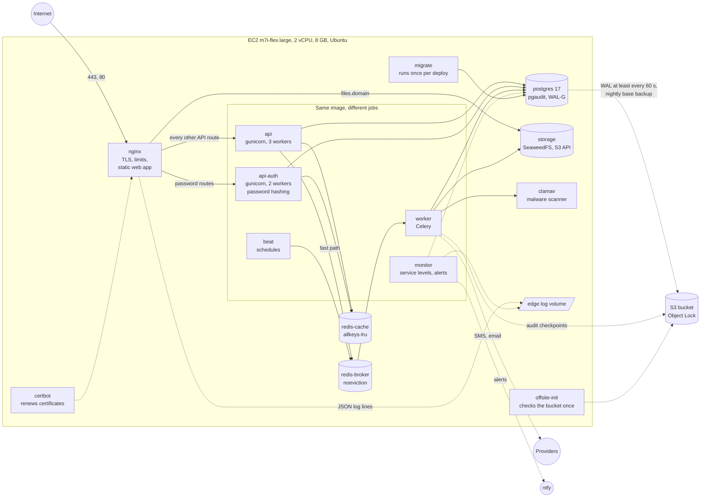
```mermaid
flowchart LR
  internet((Internet)) -->|443, 80| nginx

  subgraph host [EC2 m7i-flex.large, 2 vCPU, 8 GB, Ubuntu]
    nginx[nginx<br/>TLS, limits,<br/>static web app]
    certbot[certbot<br/>renews certificates]

    subgraph app [Same image, different jobs]
      api[api<br/>gunicorn, 3 workers]
      auth[api-auth<br/>gunicorn, 2 workers<br/>password hashing]
      worker[worker<br/>Celery]
      beat[beat<br/>schedules]
      monitor[monitor<br/>service levels, alerts]
    end

    pg[(postgres 17<br/>pgaudit, WAL-G)]
    broker[(redis-broker<br/>noeviction)]
    cache[(redis-cache<br/>allkeys-lru)]
    storage[(storage<br/>SeaweedFS, S3 API)]
    clamav[clamav<br/>malware scanner]
    edgelog[/edge log volume/]

    migrate[migrate<br/>runs once per deploy]
    offinit[offsite-init<br/>checks the bucket once]
  end

  nginx -->|password routes| auth
  nginx -->|every other API route| api
  nginx -->|files.domain| storage
  nginx -.->|JSON log lines| edgelog
  certbot -.-> nginx

  api --> pg
  auth --> pg
  api --> cache
  auth --> cache
  api -->|fast path| broker
  beat --> broker
  broker --> worker
  worker --> pg
  worker --> storage
  worker --> clamav
  worker -.->|SMS, email| out((Providers))
  monitor -.-> edgelog
  monitor -.-> pg
  monitor -.->|alerts| ntfy((ntfy))

  pg -.->|WAL at least every 60 s,<br/>nightly base backup| s3[(S3 bucket<br/>Object Lock)]
  worker -.->|audit checkpoints| s3
  migrate --> pg
  offinit -.-> s3
```

A standby PostgreSQL (`postgres-standby`, profile `standby`) and Mailpit (profile `local-mail`) exist but are off on the live server.

---

## 3. The edge: how Nginx routes a request

From `deploy/nginx/grs/api.conf`. The first matching regular expression wins, so password routes reach `api-auth` before the general `/api/v1/auth/` rule can take them. A meta-test fails if a route that hashes a password is missing from the first list.

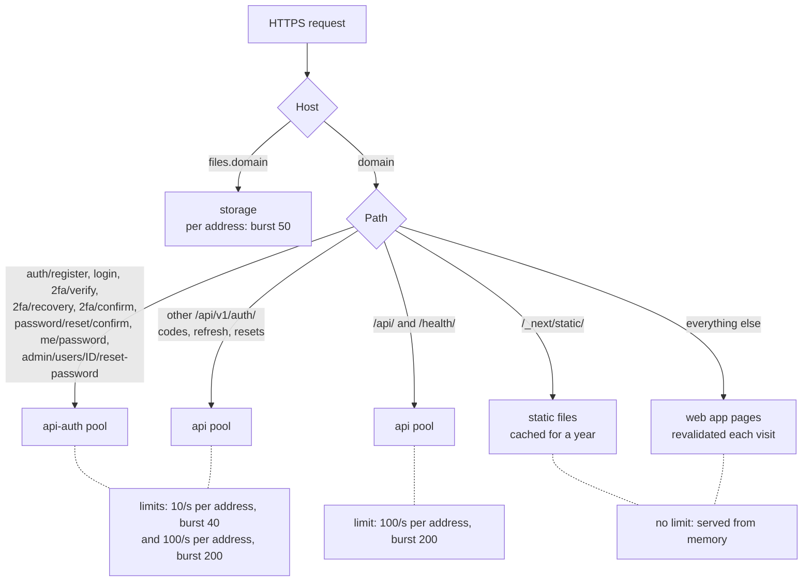
```mermaid
flowchart TD
  req[HTTPS request] --> host{Host}
  host -->|files.domain| files[storage<br/>per address: burst 50]
  host -->|domain| path{Path}

  path -->|"auth/register, login, 2fa/verify,<br/>2fa/recovery, 2fa/confirm,<br/>password/reset/confirm, me/password,<br/>admin/users/ID/reset-password"| hashing[api-auth pool]
  path -->|"other /api/v1/auth/<br/>codes, refresh, resets"| authapi[api pool]
  path -->|"/api/ and /health/"| api[api pool]
  path -->|"/_next/static/"| immutable[static files<br/>cached for a year]
  path -->|everything else| pages[web app pages<br/>revalidated each visit]

  hashing -.- l1[limits: 10/s per address, burst 40<br/>and 100/s per address, burst 200]
  authapi -.- l1
  api -.- l2[limit: 100/s per address, burst 200]
  immutable -.- l3[no limit: served from memory]
  pages -.- l3
```

Over the limit, Nginx answers `429` with the API's own JSON error and `Retry-After`, without reaching Python. API responses are not compressed (BREACH); static files are served pre-gzipped.

---

## 4. The timeout ladder

Each layer gives up before the one above it. A stuck query is cancelled by PostgreSQL at 5 s; the worker answers with an error, well before Gunicorn (15 s) would kill it or Nginx (20 s) would answer `504` on its behalf.

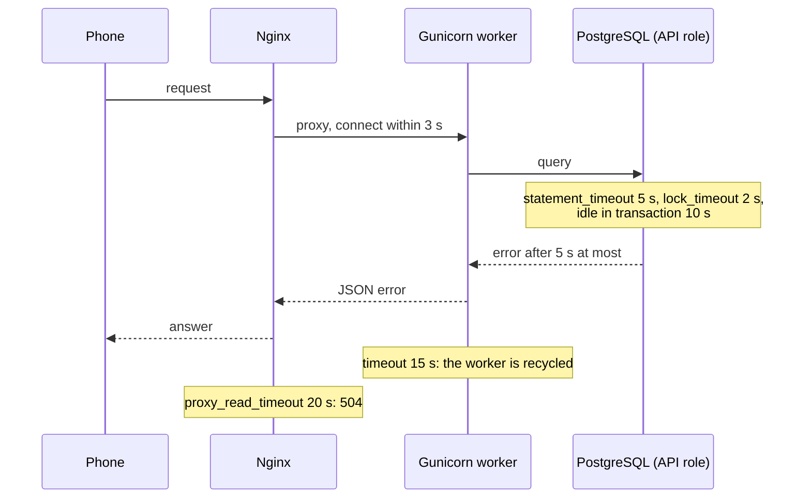
```mermaid
sequenceDiagram
  participant P as Phone
  participant N as Nginx
  participant G as Gunicorn worker
  participant D as PostgreSQL (API role)
  P->>N: request
  N->>G: proxy, connect within 3 s
  G->>D: query
  Note over D: statement_timeout 5 s, lock_timeout 2 s,<br/>idle in transaction 10 s
  D-->>G: error after 5 s at most
  G-->>N: JSON error
  N-->>P: answer
  Note over G: timeout 15 s: the worker is recycled
  Note over N: proxy_read_timeout 20 s: 504
```

Sources: `deploy/postgres/roles.sql`, `deploy/gunicorn/api.py`, `deploy/nginx/grs/api.conf`.

---

## 5. Layers of rate limiting

Each layer is keyed on something different. The address limits are generous because thousands of phones share one address behind carrier NAT; the limits that bite are per phone and per account. Sources: `deploy/nginx/grs/http.conf`, `apps/common/ratelimit.py`, `apps/accounts/throttle.py`, `apps/accounts/otp.py`, `apps/accounts/services.py`.

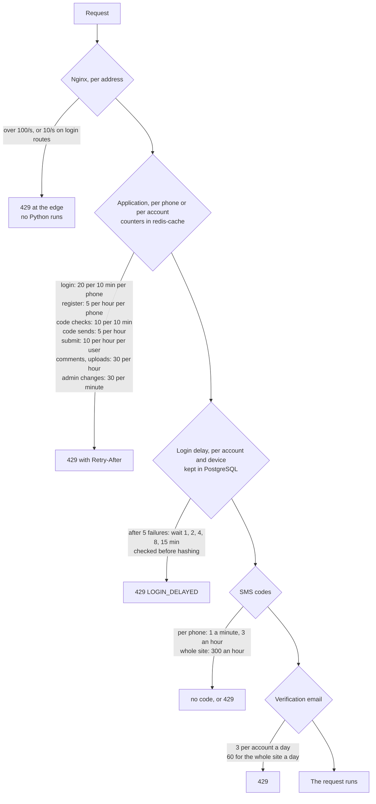
```mermaid
flowchart TD
  a[Request] --> e1{Nginx, per address}
  e1 -->|"over 100/s, or 10/s on login routes"| r1[429 at the edge<br/>no Python runs]
  e1 --> e2{Application, per phone or per account<br/>counters in redis-cache}
  e2 -->|"login: 20 per 10 min per phone<br/>register: 5 per hour per phone<br/>code checks: 10 per 10 min<br/>code sends: 5 per hour<br/>submit: 10 per hour per user<br/>comments, uploads: 30 per hour<br/>admin changes: 30 per minute"| r2[429 with Retry-After]
  e2 --> e3{Login delay, per account and device<br/>kept in PostgreSQL}
  e3 -->|"after 5 failures: wait 1, 2, 4, 8, 15 min<br/>checked before hashing"| r3[429 LOGIN_DELAYED]
  e3 --> e4{SMS codes}
  e4 -->|"per phone: 1 a minute, 3 an hour<br/>whole site: 300 an hour"| r4[no code, or 429]
  e4 --> e5{Verification email}
  e5 -->|"3 per account a day<br/>60 for the whole site a day"| r5[429]
  e5 --> ok[The request runs]
```

If `redis-cache` is down, the per-phone and per-account counters fail open: citizens are never blocked by a cache outage. The login delay, the code limits and the email caps are counted in PostgreSQL and hold regardless.

---

## 6. A request's life

The 8 states and every action between them, from the rule table in `apps/service_requests/transitions.py`. Who may act: **owner** (the citizen), **assigned** (the officer it is assigned to), **department** (any officer of its department), **admin**. The same table drives the API, and CHECK constraints in PostgreSQL refuse a row that no action could have produced.

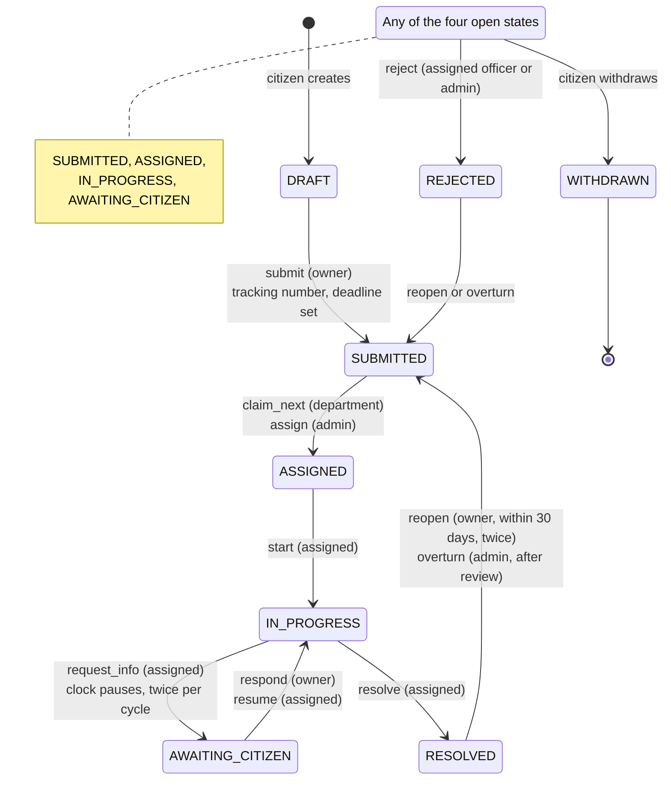
```mermaid
stateDiagram-v2
  [*] --> DRAFT: citizen creates
  DRAFT --> SUBMITTED: submit (owner)<br/>tracking number, deadline set
  SUBMITTED --> ASSIGNED: claim_next (department)<br/>assign (admin)
  ASSIGNED --> IN_PROGRESS: start (assigned)
  IN_PROGRESS --> AWAITING_CITIZEN: request_info (assigned)<br/>clock pauses, twice per cycle
  AWAITING_CITIZEN --> IN_PROGRESS: respond (owner)<br/>resume (assigned)
  IN_PROGRESS --> RESOLVED: resolve (assigned)
  RESOLVED --> SUBMITTED: reopen (owner, within 30 days, twice)<br/>overturn (admin, after review)
  REJECTED --> SUBMITTED: reopen or overturn
  state "Any of the four open states" as OPEN
  OPEN --> REJECTED: reject (assigned officer or admin)
  OPEN --> WITHDRAWN: citizen withdraws
  WITHDRAWN --> [*]
  note right of OPEN
    SUBMITTED, ASSIGNED,
    IN_PROGRESS, AWAITING_CITIZEN
  end note
```

Two actions do not change the state: `reassign` (admin, from ASSIGNED or IN_PROGRESS, with a written reason) and `set_priority` (on any open request). Neither shows on the citizen's timeline. A rejection in the last fifth of the deadline, and 5% of resolutions, go to an administrator's review queue.

---

## 7. Signing up as a citizen

From `apps/accounts/services.py`. The answer to "register" is the same whether or not the number already has an account, so the form cannot be used to find out who is registered. A correct code logs the citizen in.

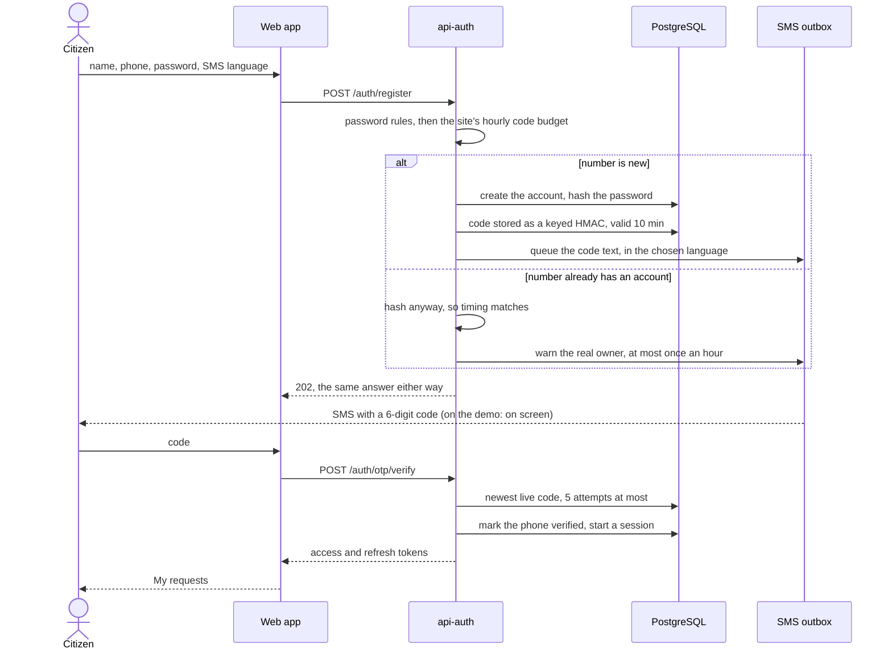
```mermaid
sequenceDiagram
  actor C as Citizen
  participant W as Web app
  participant A as api-auth
  participant D as PostgreSQL
  participant S as SMS outbox
  C->>W: name, phone, password, SMS language
  W->>A: POST /auth/register
  A->>A: password rules, then the site's hourly code budget
  alt number is new
    A->>D: create the account, hash the password
    A->>D: code stored as a keyed HMAC, valid 10 min
    A->>S: queue the code text, in the chosen language
  else number already has an account
    A->>A: hash anyway, so timing matches
    A->>S: warn the real owner, at most once an hour
  end
  A-->>W: 202, the same answer either way
  S-->>C: SMS with a 6-digit code (on the demo: on screen)
  C->>W: code
  W->>A: POST /auth/otp/verify
  A->>D: newest live code, 5 attempts at most
  A->>D: mark the phone verified, start a session
  A-->>W: access and refresh tokens
  W-->>C: My requests
```

---

## 8. An officer's first login

Officers do not register. An administrator adds them; only the officer ever chooses the password. From `apps/admin_api/services.py`.

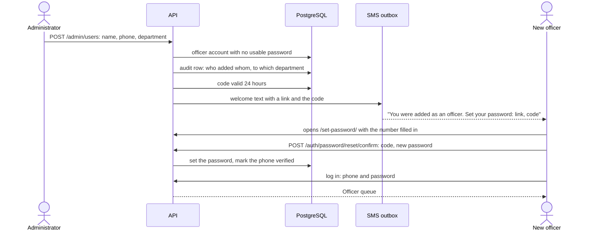
```mermaid
sequenceDiagram
  actor Ad as Administrator
  participant API as API
  participant D as PostgreSQL
  participant S as SMS outbox
  actor O as New officer
  Ad->>API: POST /admin/users: name, phone, department
  API->>D: officer account with no usable password
  API->>D: audit row: who added whom, to which department
  API->>D: code valid 24 hours
  API->>S: welcome text with a link and the code
  S-->>O: "You were added as an officer. Set your password: link, code"
  O->>API: opens /set-password/ with the number filled in
  O->>API: POST /auth/password/reset/confirm: code, new password
  API->>D: set the password, mark the phone verified
  O->>API: log in: phone and password
  API-->>O: Officer queue
```

An administrator's password reset for a staff member works the same way: the old password stops working at once, every session ends, and the staff member gets a text with the link.

---

## 9. An administrator's two-step login

From `apps/accounts/services.py` and `apps/accounts/permissions.py`. An administrator's token is worth nothing without the second step, on every route.

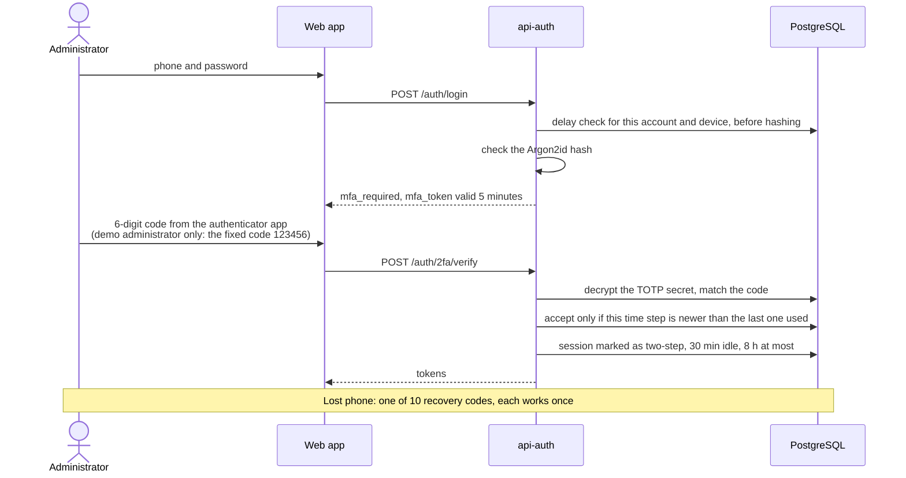
```mermaid
sequenceDiagram
  actor Ad as Administrator
  participant W as Web app
  participant A as api-auth
  participant D as PostgreSQL
  Ad->>W: phone and password
  W->>A: POST /auth/login
  A->>D: delay check for this account and device, before hashing
  A->>A: check the Argon2id hash
  A-->>W: mfa_required, mfa_token valid 5 minutes
  Ad->>W: 6-digit code from the authenticator app<br/>(demo administrator only: the fixed code 123456)
  W->>A: POST /auth/2fa/verify
  A->>D: decrypt the TOTP secret, match the code
  A->>D: accept only if this time step is newer than the last one used
  A->>D: session marked as two-step, 30 min idle, 8 h at most
  A-->>W: tokens
  Note over Ad,D: Lost phone: one of 10 recovery codes, each works once
```

---

## 10. Staying logged in

From `apps/accounts/sessions.py` ([decision 14](decisions/0014-sessions-follow-the-device.md)). Access tokens last 10 minutes. Refresh tokens are random, stored only as a hash, and rotate on every use.

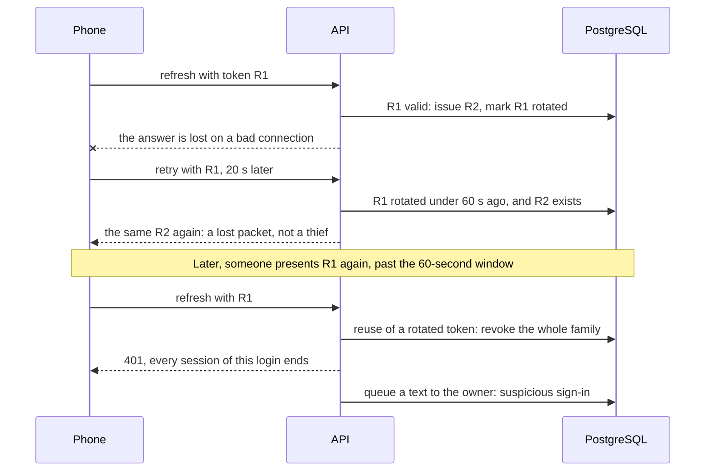
```mermaid
sequenceDiagram
  participant P as Phone
  participant A as API
  participant D as PostgreSQL
  P->>A: refresh with token R1
  A->>D: R1 valid: issue R2, mark R1 rotated
  A--xP: the answer is lost on a bad connection
  P->>A: retry with R1, 20 s later
  A->>D: R1 rotated under 60 s ago, and R2 exists
  A-->>P: the same R2 again: a lost packet, not a thief
  Note over P,D: Later, someone presents R1 again, past the 60-second window
  P->>A: refresh with R1
  A->>D: reuse of a rotated token: revoke the whole family
  A-->>P: 401, every session of this login ends
  A->>D: queue a text to the owner: suspicious sign-in
```

| Who, and on what device | Idle | At most |
|---|---|---|
| Citizen, shared computer (default) | 30 min | 8 h |
| Citizen, "this is my own device" | 30 days | 90 days |
| Officer | 4 h | 12 h |
| Administrator | 30 min | 8 h |

---

## 11. Submitting a request

From `apps/service_requests/` and `apps/common/idempotency.py`. Everything in the box commits together or not at all.

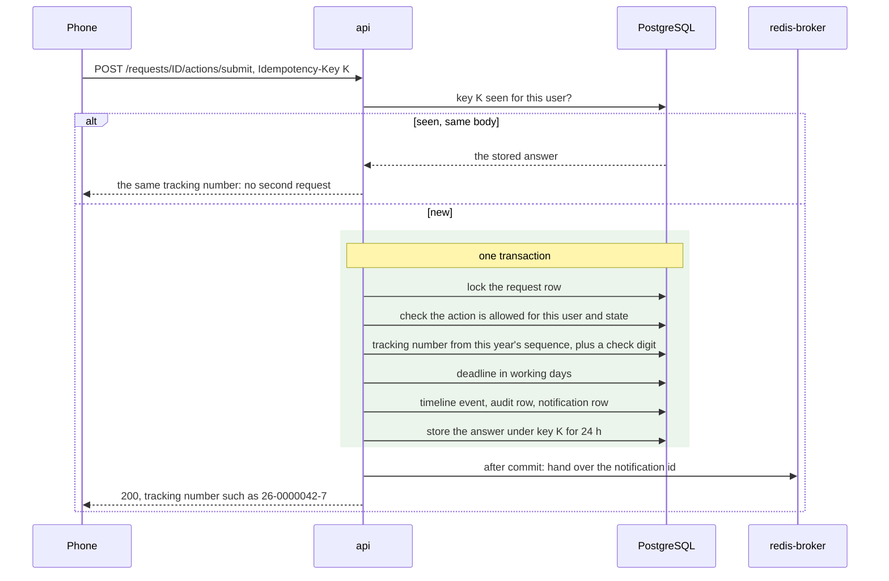
```mermaid
sequenceDiagram
  participant P as Phone
  participant A as api
  participant D as PostgreSQL
  participant B as redis-broker
  P->>A: POST /requests/ID/actions/submit, Idempotency-Key K
  A->>D: key K seen for this user?
  alt seen, same body
    D-->>A: the stored answer
    A-->>P: the same tracking number: no second request
  else new
    rect rgb(235, 245, 235)
      Note over A,D: one transaction
      A->>D: lock the request row
      A->>D: check the action is allowed for this user and state
      A->>D: tracking number from this year's sequence, plus a check digit
      A->>D: deadline in working days
      A->>D: timeline event, audit row, notification row
      A->>D: store the answer under key K for 24 h
    end
    A->>B: after commit: hand over the notification id
    A-->>P: 200, tracking number such as 26-0000042-7
  end
```

The same request submitted twice within minutes gets a "you already submitted this" question first, not a second tracking number.

---

## 12. Delivering a message

From `apps/notifications/` and `apps/common/broker.py` ([decision 2](decisions/0002-notifications-through-an-outbox.md)). The broker only makes delivery fast; the row in PostgreSQL makes it certain.

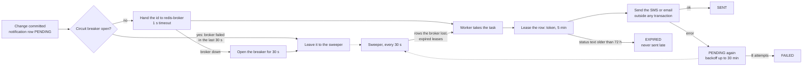
```mermaid
flowchart LR
  commit[Change committed<br/>notification row PENDING] --> cb{Circuit breaker open?}
  cb -->|no| enqueue[Hand the id to redis-broker<br/>1 s timeout]
  cb -->|yes: broker failed<br/>in the last 30 s| wait[Leave it to the sweeper]
  enqueue -->|broker down| trip[Open the breaker for 30 s] --> wait
  enqueue --> worker[Worker takes the task]
  sweeper[Sweeper, every 30 s] -->|rows the broker lost,<br/>expired leases| worker
  wait -.-> sweeper
  worker --> lease[Lease the row: token, 5 min]
  lease --> send[Send the SMS or email<br/>outside any transaction]
  send -->|ok| sent[SENT]
  send -->|error| retry[PENDING again<br/>backoff up to 30 min]
  retry -.-> sweeper
  retry -->|8 attempts| failed[FAILED]
  lease -->|status text older than 72 h| expired[EXPIRED<br/>never sent late]
```

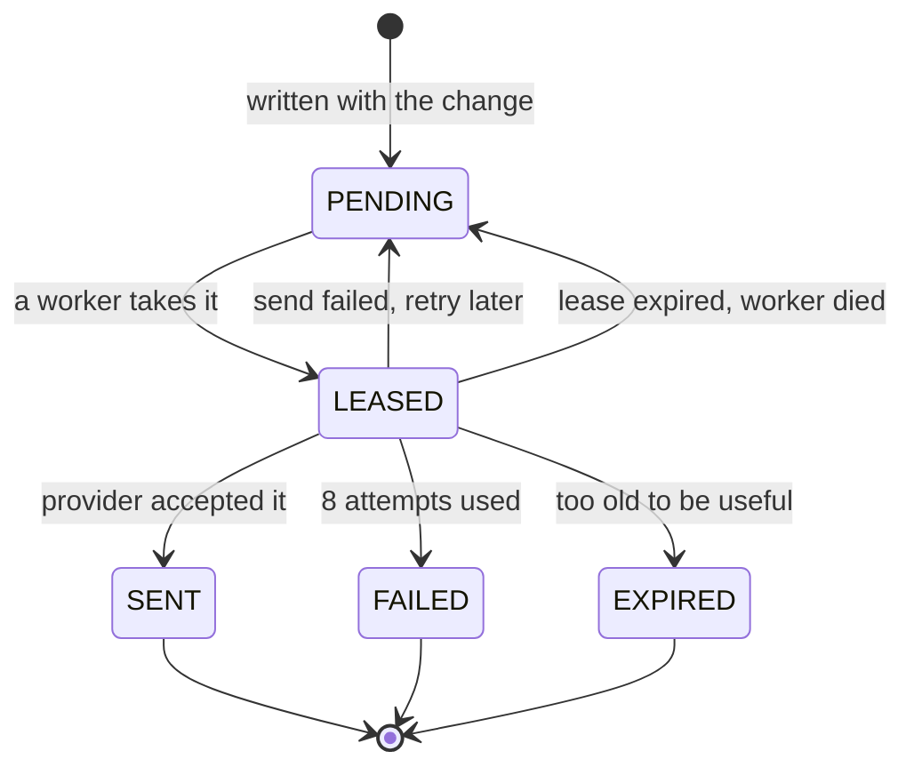
```mermaid
stateDiagram-v2
  [*] --> PENDING: written with the change
  PENDING --> LEASED: a worker takes it
  LEASED --> SENT: provider accepted it
  LEASED --> PENDING: send failed, retry later
  LEASED --> PENDING: lease expired, worker died
  LEASED --> FAILED: 8 attempts used
  LEASED --> EXPIRED: too old to be useful
  SENT --> [*]
  FAILED --> [*]
  EXPIRED --> [*]
```

A code or a verification link is erased from the row once sent.

---

## 13. Attaching a file

From `apps/collab/storage.py` and `apps/collab/verification.py` ([decision 7](decisions/0007-uploads-go-straight-to-storage.md)). The file never passes through the API, so a slow upload on 2G holds no web worker.

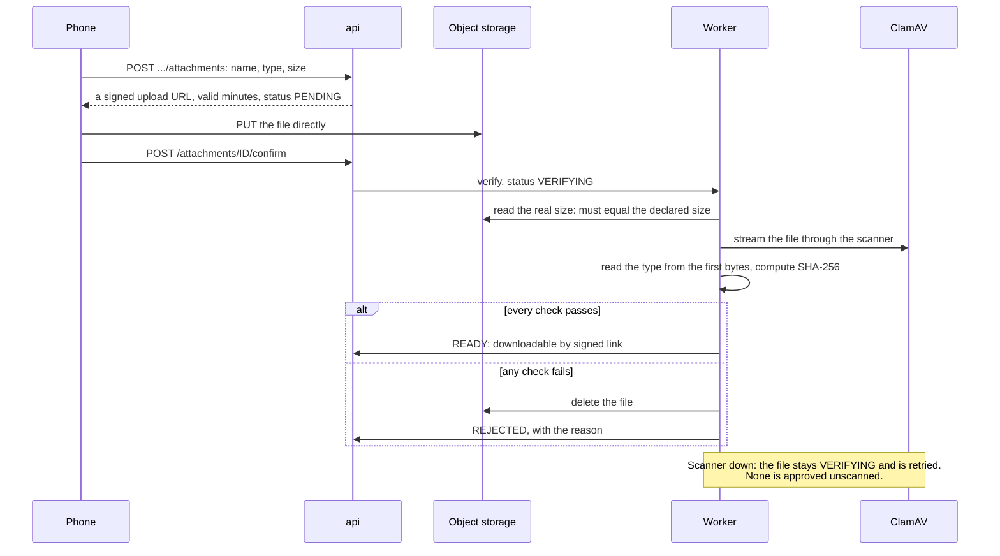
```mermaid
sequenceDiagram
  participant P as Phone
  participant A as api
  participant S as Object storage
  participant W as Worker
  participant V as ClamAV
  P->>A: POST .../attachments: name, type, size
  A-->>P: a signed upload URL, valid minutes, status PENDING
  P->>S: PUT the file directly
  P->>A: POST /attachments/ID/confirm
  A->>W: verify, status VERIFYING
  W->>S: read the real size: must equal the declared size
  W->>V: stream the file through the scanner
  W->>W: read the type from the first bytes, compute SHA-256
  alt every check passes
    W->>A: READY: downloadable by signed link
  else any check fails
    W->>S: delete the file
    W->>A: REJECTED, with the reason
  end
  Note over W,V: Scanner down: the file stays VERIFYING and is retried.<br/>None is approved unscanned.
```

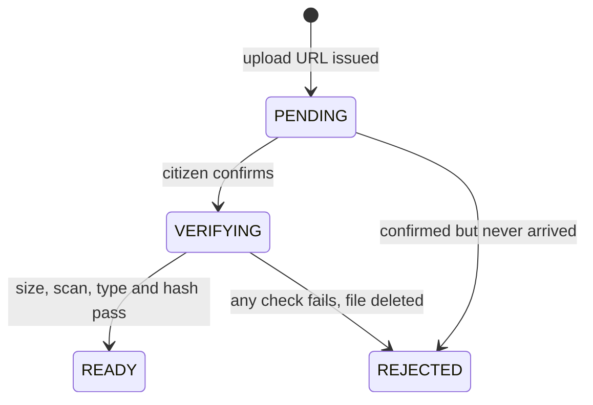
```mermaid
stateDiagram-v2
  [*] --> PENDING: upload URL issued
  PENDING --> VERIFYING: citizen confirms
  VERIFYING --> READY: size, scan, type and hash pass
  VERIFYING --> REJECTED: any check fails, file deleted
  PENDING --> REJECTED: confirmed but never arrived
```

---

## 14. The audit chain

From `apps/audit/sealing.py` and `apps/audit/offsite.py` ([decision 6](decisions/0006-hash-chained-audit-log.md)).

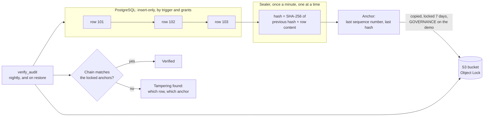
```mermaid
flowchart LR
  subgraph db [PostgreSQL: insert-only, by trigger and grants]
    r1[row 101] --> r2[row 102] --> r3[row 103]
  end
  subgraph seal [Sealer, once a minute, one at a time]
    h["hash = SHA-256 of<br/>previous hash + row content"]
  end
  r3 --> h
  h --> anchor[Anchor:<br/>last sequence number, last hash]
  anchor -->|copied, locked 7 days,<br/>GOVERNANCE on the demo| bucket[(S3 bucket<br/>Object Lock)]
  verify[verify_audit<br/>nightly, and on restore] --> db
  verify --> bucket
  verify --> result{Chain matches<br/>the locked anchors?}
  result -->|yes| okv[Verified]
  result -->|no| alert[Tampering found:<br/>which row, which anchor]
```

Why it holds: editing a row breaks every hash after it. Rewriting all those hashes, and the database's own copy of the anchors, still disagrees with the copies in the bucket, which the server's credentials cannot change.

---

## 15. Backups and recovery

From `deploy/postgres/wal-archive.sh`, `deploy/scripts/` ([decision 11](decisions/0011-continuous-backups-off-the-server.md)).

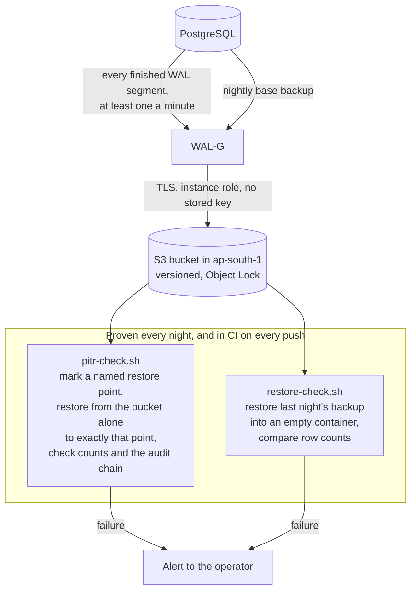
```mermaid
flowchart TB
  pg[(PostgreSQL)] -->|every finished WAL segment,<br/>at least one a minute| walg[WAL-G]
  pg -->|nightly base backup| walg
  walg -->|TLS, instance role, no stored key| bucket[(S3 bucket in ap-south-1<br/>versioned, Object Lock)]

  subgraph proof [Proven every night, and in CI on every push]
    rc[restore-check.sh<br/>restore last night's backup<br/>into an empty container,<br/>compare row counts]
    pitr[pitr-check.sh<br/>mark a named restore point,<br/>restore from the bucket alone<br/>to exactly that point,<br/>check counts and the audit chain]
  end
  bucket --> rc
  bucket --> pitr
  pitr -->|failure| alert[Alert to the operator]
  rc -->|failure| alert
```

| | Value | Source |
|---|---|---|
| Most data lost with the server | 60 s | `archive_timeout = 60` |
| Restore to a named moment, demo size | 7 s | [evaluation](evaluation.md#7-q5-can-the-data-be-recovered-and-can-history-be-rewritten) |
| Full rebuild on a new server | not timed | [limitations](limitations.md#4-availability-and-scale) |

---

## 16. The night on the server

From `/etc/cron.d/grs` on the live server and the Celery schedule in `config/settings/base.py`. Times in Dhaka (UTC+6).

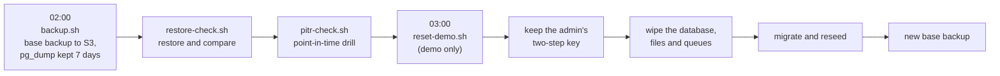
```mermaid
flowchart LR
  t0["02:00<br/>backup.sh<br/>base backup to S3,<br/>pg_dump kept 7 days"] --> t1["restore-check.sh<br/>restore and compare"] --> t2["pitr-check.sh<br/>point-in-time drill"]
  t2 --> t3["03:00<br/>reset-demo.sh<br/>(demo only)"]
  t3 --> t4["keep the admin's<br/>two-step key"] --> t5["wipe the database,<br/>files and queues"] --> t6["migrate and reseed"] --> t7["new base backup"]
```

All day, from Celery beat: notification sweeper every 30 s; audit sealing every minute; stuck-upload sweeper and overdue escalation every 5 minutes; expired idempotency records purged every hour. The monitor reads the edge log every minute; GitHub Actions checks the public address every 10 minutes.

---

## 17. Database roles

From `deploy/postgres/roles.sql` ([decision 1](decisions/0001-postgresql-enforces-the-rules.md)). The application cannot change the schema it runs on, and nothing can edit a log row.

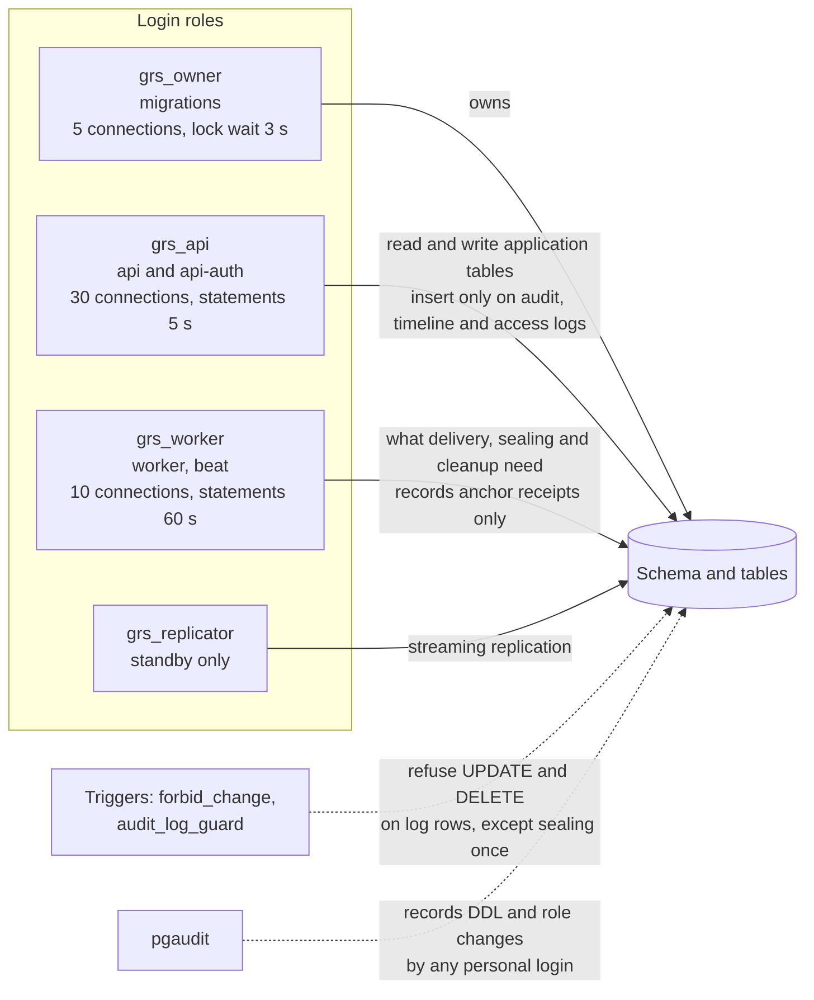
```mermaid
flowchart LR
  subgraph roles [Login roles]
    owner[grs_owner<br/>migrations<br/>5 connections, lock wait 3 s]
    apir[grs_api<br/>api and api-auth<br/>30 connections, statements 5 s]
    workr[grs_worker<br/>worker, beat<br/>10 connections, statements 60 s]
    repl[grs_replicator<br/>standby only]
  end
  owner -->|owns| schema[(Schema and tables)]
  apir -->|"read and write application tables<br/>insert only on audit, timeline and access logs"| schema
  workr -->|"what delivery, sealing and cleanup need<br/>records anchor receipts only"| schema
  repl -->|streaming replication| schema
  triggers[Triggers: forbid_change,<br/>audit_log_guard] -.->|refuse UPDATE and DELETE<br/>on log rows, except sealing once| schema
  pgaudit[pgaudit] -.->|records DDL and role changes<br/>by any personal login| schema
```

---

## 18. Data model

The main tables and their links. The tables that only grow (`audit_log`, `access_event`, `access_event_item`, `request_event`, `notification`) are partitioned by time, each with a default partition so an insert never fails for a missing one. Source: the `models.py` of each app.

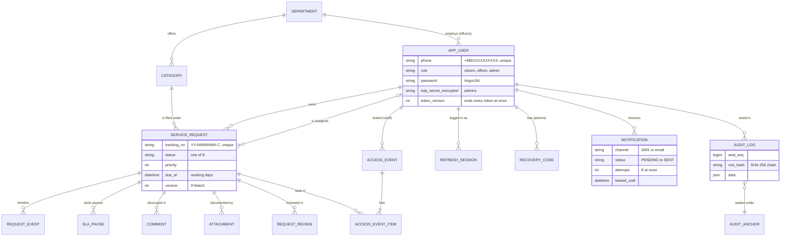
```mermaid
erDiagram
  DEPARTMENT ||--o{ CATEGORY : offers
  DEPARTMENT ||--o{ APP_USER : "employs (officers)"
  CATEGORY ||--o{ SERVICE_REQUEST : "is filed under"
  APP_USER ||--o{ SERVICE_REQUEST : owns
  APP_USER |o--o{ SERVICE_REQUEST : "is assigned"
  SERVICE_REQUEST ||--o{ REQUEST_EVENT : "timeline"
  SERVICE_REQUEST ||--o{ SLA_PAUSE : "clock pauses"
  SERVICE_REQUEST ||--o{ COMMENT : "discussed in"
  SERVICE_REQUEST ||--o{ ATTACHMENT : "documented by"
  SERVICE_REQUEST ||--o{ REQUEST_REVIEW : "reviewed in"
  SERVICE_REQUEST ||--o{ ACCESS_EVENT_ITEM : "seen in"
  ACCESS_EVENT ||--|{ ACCESS_EVENT_ITEM : lists
  APP_USER ||--o{ ACCESS_EVENT : "looked (staff)"
  APP_USER ||--o{ REFRESH_SESSION : "logged in as"
  APP_USER ||--o{ RECOVERY_CODE : "has (admins)"
  APP_USER ||--o{ NOTIFICATION : receives
  APP_USER ||--o{ AUDIT_LOG : "acted in"
  AUDIT_LOG }o--|| AUDIT_ANCHOR : "sealed under"

  SERVICE_REQUEST {
    string tracking_no "YY-NNNNNNN-C, unique"
    string status "one of 8"
    int priority
    datetime due_at "working days"
    int version "If-Match"
  }
  APP_USER {
    string phone "+8801XXXXXXXXX, unique"
    string role "citizen, officer, admin"
    string password "Argon2id"
    string totp_secret_encrypted "admins"
    int token_version "ends every token at once"
  }
  NOTIFICATION {
    string channel "SMS or email"
    string status "PENDING to SENT"
    int attempts "8 at most"
    datetime leased_until
  }
  AUDIT_LOG {
    bigint seal_seq
    string row_hash "SHA-256 chain"
    json data
  }
```

Also: `holiday`, `sla_suspension` (the calendar), `otp_challenge`, `login_throttle`, `idempotency_record`, `audit_anchor`, `access_alert`, `feature_switch`, and `demo_sms` (demo mode only).

---

## 19. How a deadline is set

From `apps/sla/calendar.py` and `apps/sla/services.py`.

```mermaid
flowchart TD
  start[Submitted, or reopened] --> day[Start day in Dhaka time<br/>never counts, whatever the hour]
  day --> count[Count forward N working days<br/>N = the category's target]
  count --> working{Is the day working?}
  working -->|Friday or Saturday| skip[Skip]
  working -->|a holiday| skip
  working -->|an office closure<br/>for this department or all| skip
  working -->|yes| counted[Counts]
  skip --> count
  counted --> due[Deadline: end of the Nth working day]
  due --> pause{Officer asks the citizen?}
  pause -->|yes| stop[Clock stops, SlaPause opened]
  stop -->|citizen answers| extend[Deadline moves by the<br/>working days paused]
  extend --> due
  due --> late{Past the deadline?}
  late -->|every 5 min| escalate[Flagged once per cycle,<br/>officer and admins told]
  admin[Admin adds a holiday or closure] -->|recompute open requests,<br/>in batches, same row locks| due
```

---

## 20. Watching it

From `apps/monitoring/` ([decision 10](decisions/0010-alerts-from-the-edge-log.md)).

```mermaid
flowchart LR
  nginx[Nginx] -->|one JSON line per request| log[/edge log/]
  log --> mon[monitor<br/>every minute]
  mon --> counts[Per-minute counts, 6 hours:<br/>requests, 5xx, latency histogram]
  mon --> deps[Checks: database, public URL and TLS,<br/>disk, certificate, WAL archiving,<br/>stuck messages, stuck uploads,<br/>anchors not yet off the host]
  counts --> burn{Burn rate}
  burn -->|"1 h and 5 min over 7.2%:<br/>budget gone in about 2 days"| fast[availability_fast_burn]
  burn -->|"6 h and 30 min over 3%:<br/>gone in about 5 days"| slow[availability_slow_burn]
  counts -->|p95 over 1 s for 15 min| lat[latency]
  deps --> other[site_down, database_down,<br/>notifications_late, attachments_stuck,<br/>audit_anchors_pending, wal_archiving,<br/>disk_full, certificate_expiring]
  fast --> ntfy[ntfy: on start, every 2 h, on clear]
  slow --> ntfy
  lat --> ntfy
  other --> ntfy
  gha[GitHub Actions, every 10 min,<br/>from outside] -->|server dark| ntfy
  ntfy --> phone([Operator's phone])
```

---

## 21. From a commit to the live site

From `.github/workflows/ci.yml` and `deploy/scripts/deploy.sh`. Every change, documentation included, goes through a pull request and green CI.

```mermaid
flowchart TD
  pr[Pull request] --> ci{CI: five jobs in parallel}
  ci --> lint[lint<br/>ruff, format]
  ci --> test[test<br/>1,105 tests against real PostgreSQL,<br/>coverage, translations compiled]
  ci --> web[web<br/>whole stack up, demo data,<br/>Playwright through every role]
  ci --> clam[clamav<br/>scanner against real ClamAV]
  ci --> smoke[smoke<br/>served through Nginx, JSON 404s,<br/>HTTPS bucket reachable,<br/>point-in-time recovery drill]
  lint & test & web & clam & smoke --> green{All green?}
  green -->|yes, and the owner says merge| merge[Squash-merge to main]
  merge --> deploy[deploy.sh on the server]
  deploy --> build[Build images, run migrations,<br/>start the new build]
  build --> health{/health/ready through TLS<br/>reports the new commit<br/>within 2 minutes?}
  health -->|yes| live[Live]
  health -->|no| back[Roll the code back<br/>to the previous commit]
  back --> health2{Healthy again?}
  health2 -->|yes| rolled[Rolled back, deploy failed loudly]
  health2 -->|no| page[Both unhealthy: operator steps in]
```

Rollback moves code, not the database, so migrations are additive only; a meta-test refuses one that would lock a live table.
